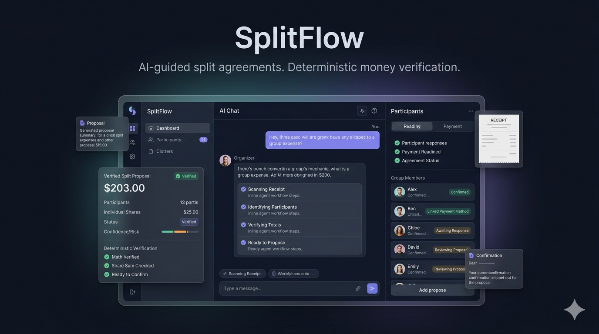

# SplitFlow

### AI-Powered Copilot for Group Payments

Most bill-splitting apps solve the math.<br>
SplitFlow solves the agreement.

SplitFlow turns messy shared-cost conversations into reviewable, tool-verified payment proposals, helping groups move from confusion, claims, and awkward payment questions to a clear agreement state.

[Live Demo](https://splitflow-xi.vercel.app/) · [Technical Docs](docs/TECHNICAL.md) · [LinkedIn](https://www.linkedin.com/in/zsyhmizlkfli/)

**TypeScript · Next.js · OpenAI API · Tailwind CSS · Domain-Driven Design · Vercel**

> AI structures the conversation. Tools verify the agreement.



---

## Why SplitFlow Exists

Shared payments usually break down before the actual payment happens.

The hard part is not only calculating who owes what. The hard part is agreeing on what happened: who joined, who paid first, who opted out, who already claimed a payment, and whether the group is actually ready to pay.

SplitFlow treats group expenses as an agreement workflow, not just a calculator problem.

---

## How It Works

```txt
Messy shared-cost conversation
        ↓
AI interprets the expense situation
        ↓
SplitFlow creates a reviewable payment proposal
        ↓
Participants confirm, challenge, or update claims
        ↓
Tools verify math, rounding, eligibility, claims, and readiness
        ↓
The group reaches a clear payment agreement
```

Example prompt:

> "We ordered food for 5 people, but Mina only got drinks, Joon paid first, and Alex already sent part of his share."

SplitFlow turns that messy context into a structured payment proposal with participant state, split logic, payment claims, and readiness checks.

---

## Engineering Focus

SplitFlow was built around one core engineering decision:

> AI can guide the workflow, but tools must verify the money.

- **Agreement-first domain model** - group payments are modeled as proposal states, participant responses, eligibility, payment claims, revisions, and readiness checks instead of a one-time calculator result.
- **Tool-orchestrated verification** - split math, item eligibility, rounding, settlement instructions, payment claims, and readiness-to-pay status are checked through deterministic TypeScript logic.
- **AI-guided proposal flow** - messy shared-cost conversations are converted into structured, reviewable payment proposals through a server-side orchestration path.
- **Human-in-the-loop review** - organizers and participants can confirm, challenge, opt out, accept changes, or mark settlement progress before payment readiness is reached.
- **Production-style full-stack build** - implemented with Next.js, TypeScript, Tailwind CSS, OpenAI API support, Vitest, Playwright, and Vercel.

For architecture, domain logic, AI workflow design, validation rules, and implementation details, see the [Technical Documentation](docs/TECHNICAL.md).

---

## Why It Is Different

| Traditional Split Apps  | SplitFlow                                 |
| ----------------------- | ----------------------------------------- |
| Calculator-first        | Agreement-first                           |
| Manual form input       | Natural language expense prompts          |
| Static split result     | Reviewable proposal flow                  |
| Assumes everyone agrees | Tracks participant responses              |
| Focuses only on amounts | Tracks claims, eligibility, and readiness |
| Splits the bill         | Helps the group reach agreement           |

---

## Demo & Links

- **Live Demo:** [Try SplitFlow](https://splitflow-xi.vercel.app/)
- **Technical Deep Dive:** [docs/TECHNICAL.md](docs/TECHNICAL.md)
- **Product Case Study:** [docs/shardlab-product-case-study.md](docs/shardlab-product-case-study.md)
- **LinkedIn:** [Connect with me](https://www.linkedin.com/in/zsyhmizlkfli/)

> AI structures the conversation. Tools verify the agreement.
