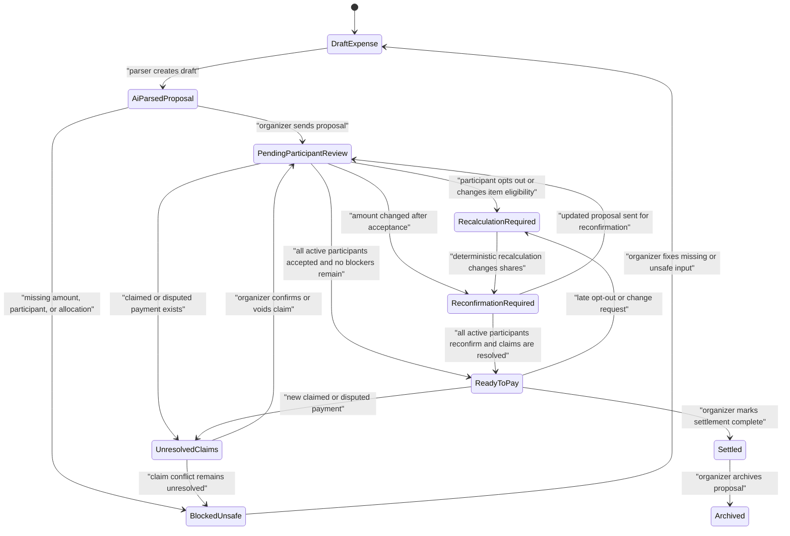

# SplitFlow Agreement State Machine

SplitFlow treats payment readiness as a state-machine decision, not a vague AI judgment. AI can interpret messy shared-cost context and draft a proposal, but a proposal is only safe to pay when deterministic state, participant responses, payment-claim records, and calculation invariants allow it.

The important safety rule is:

> A proposal cannot be marked ready while participant claims are unresolved.

## State Diagram

## State Definitions

| State | Meaning | Current code anchor |
| --- | --- | --- |
| Draft expense | Organizer has messy input or a draft proposal that has not been sent. | `Proposal.status === "draft"` |
| AI-parsed proposal | Parser/workflow produced a structured proposal artifact, but the organizer still reviews it. | `lib/prototype-proposals.ts`, `lib/workflow/workflow-service.ts` |
| Pending participant review | Proposal was sent and active participants need to accept, opt out, or request changes. | `waiting_for_responses` |
| Unresolved claims | One or more payment records are `claimed` or `disputed`. These cannot count as confirmed money. | `paymentRecords`, `lib/domain/financial-invariants.ts` |
| Recalculation required | Participant opt-out or changed eligibility means shares need deterministic recalculation. | `recalculation_needed`, `recalculateProposal()` |
| Reconfirmation required | Amounts changed after earlier responses, so accepted participants must check again. | `needs_reconfirmation` |
| Ready to pay | Active participants accepted, no unresolved claims remain, deterministic totals reconcile, and readiness has no blockers. | `safe_to_book`, `deriveSplitReadiness()` |
| Blocked / unsafe to finalize | Missing data, unresolved conflict, calculation warning, or unsafe transition blocks readiness. | parser issues, invariant violations |
| Settled | Organizer marked the split collected or paid. | `settled` |
| Archived | Proposal is no longer active. | `archived` |

## Allowed Transitions

- `draft` -> `waiting_for_responses` when the organizer sends a reviewed proposal.
- `waiting_for_responses` -> `changes_requested` when a participant requests a change.
- `waiting_for_responses` -> `recalculation_needed` when a participant opts out.
- `changes_requested` -> `needs_reconfirmation` when the organizer accepts a change and deterministic recalculation updates shares.
- `needs_reconfirmation` -> `safe_to_book` only after active participants reconfirm and claims are resolved.
- `safe_to_book` -> `partially_paid`, `settling`, or `settled` when settlement actions are recorded.
- Any non-terminal active state -> `needs_reconfirmation` when already-accepted participant amounts change.

## Blocked Transitions

- Draft proposal -> ready to pay without participant review.
- Proposal with `claimed` or `disputed` payment records -> ready to pay.
- Proposal with pending participants -> ready to pay.
- Proposal with requested changes -> ready to pay.
- Proposal with opted-out participants and stale amounts -> ready to pay.
- Proposal with deterministic calculation warnings -> ready to pay.
- Proposal with shares that do not sum to total -> ready to pay.
- Proposal with non-integer KRW money values -> ready to pay.

## Reconfirmation Triggers

Reconfirmation is required when:

- A participant opts out after shares were already accepted.
- An item eligibility rule changes, such as "Daniel should not pay for meat."
- A change request is accepted and recalculation changes participant amounts.
- A payment claim is confirmed, disputed, voided, or otherwise changes the remaining net settlement.
- Any deterministic recalculation changes the amount owed by a participant who had already accepted.

The workflow rule is conservative: changed money invalidates prior acceptance until the affected participants reconfirm.
